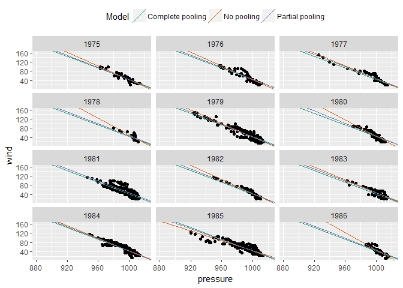
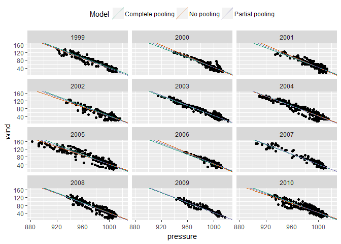
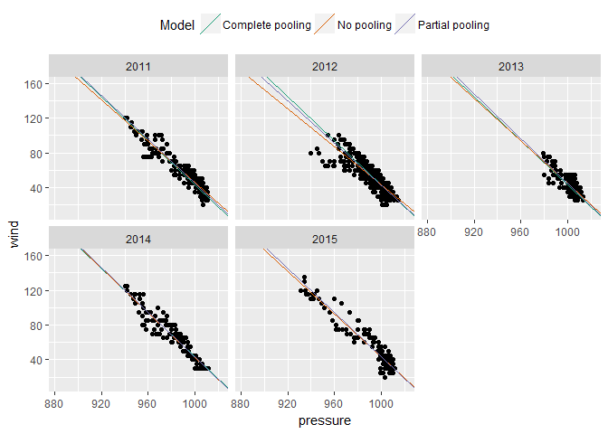

<!-- README.md is generated from README.Rmd. Please edit that file -->
lme4plotpartial
===============

R package to plot the complete pooling, no pooling, and partially pooled estimates for a mixed effects model based on [code from TJ Mahr](https://tjmahr.github.io/plotting-partial-pooling-in-mixed-effects-models/).

Installation
------------

You can install lme4plotpartial from github with:

``` r
# install.packages("devtools")
devtools::install_github("jrosen48/lme4plotpartial")
```

Example
-------

Has one function, `plot_partial_pooling()`, used as follows:

``` r
library(lme4plotpartial)
library(dplyr)
#> Warning: package 'dplyr' was built under R version 3.4.1
#> 
#> Attaching package: 'dplyr'
#> The following objects are masked from 'package:stats':
#> 
#>     filter, lag
#> The following objects are masked from 'package:base':
#> 
#>     intersect, setdiff, setequal, union
library(ggforce)
#> Warning: package 'ggforce' was built under R version 3.4.1
#> Loading required package: ggplot2

p <- plot_partial_pooling(storms, y_var = wind, x_var = pressure, group = year)

# Split the facets over several pages
p + facet_wrap_paginate("year", ncol = 3, nrow = 4, page = 1)
```



``` r
p + facet_wrap_paginate("year", ncol = 3, nrow = 4, page = 2) 
```


``` r
p + facet_wrap_paginate("year", ncol = 3, nrow = 4, page = 3) 
```



``` r
p + facet_wrap_paginate("year", ncol = 3, nrow = 4, page = 4) 
```



Future Improvements
-------------------

-   Take additional arguments for covariates and additional random effects.
